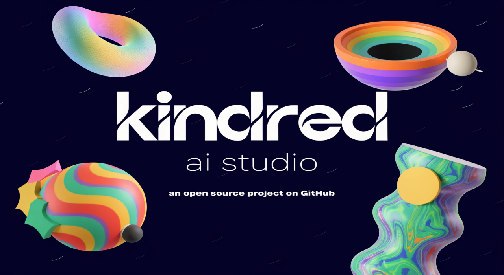

# Kindred AI Studio

A full-stack vibe coding platform — describe what you want to build in natural language and watch it generate, deploy, and live-preview your application inside a secure cloud sandbox.

## What's New (v3.0)

- **Expert Skill System:** Three built-in AI personas — 💻 Software Engineer, 🚀 DevOps, and 🔒 Security — each with a distinct system prompt, routing preference, and error-fix strategy.
- **Deep Research Agent:** Google ADK-powered programmer specialist with web search and human-in-the-loop clarification, rendered as a collapsible step trail inline in the chat thread.
- **Inline Agentic Bubble:** Every AI generation now shows a collapsible process trail (Thinking → Generating → Deploying → Fixing) attached to each message.
- **Sandbox Persistence:** Sandboxes are restored automatically on page refresh via `Sandbox.connect()`. Preview URLs are persisted to the database after the first successful deploy.
- **Zero-Dependency Architecture:** SQLite (WAL mode) handles caching, rate limiting, and job queuing — no Redis required.

## Core Features

- **Multi-Model Routing:** Intelligent routing between Gemini 2.5 Pro and Claude Sonnet 4.6 based on task type and active skill.
- **Live Cloud Sandboxes:** Code executes in E2B micro-VMs with auto-install, dev server startup, and live preview URLs.
- **Agentic Fix Loop:** Deploy failures automatically trigger AI-generated fixes and redeploy — up to 3 iterations.
- **Monaco Code Editor:** Edit generated files directly and deploy changes back to the sandbox with one click.
- **Secure Auth:** Clerk authentication with automatic dashboard redirect for logged-in users.

## Tech Stack

| Component | Technology |
|---|---|
| Frontend | Next.js, React, TypeScript, Tailwind CSS, Clerk, Monaco Editor, Framer Motion |
| Backend | Node.js, Express, TypeScript, Google ADK, Vertex AI |
| AI Models | Gemini 2.5 Pro (Vertex), Claude Sonnet 4.6 (Vertex) |
| Research Agent | Python 3.13, FastAPI, Google ADK, `google_search` tool |
| Database | PostgreSQL 16 (projects, chat, usage stats) |
| Cache / Queue | SQLite WAL |
| Sandboxes | E2B Code Interpreter |

## Prerequisites

- Node.js 20+
- Python 3.13+
- Docker & Docker Compose
- API keys for: Clerk, Google Gemini (or GCP project for Vertex), E2B

## Quick Start

### 1. Environment Setup

```bash
cp .env.example .env
# Edit .env — minimum required: CLERK keys, GOOGLE_GEMINI_API_KEY, E2B_API_KEY, DATABASE_URL
```

### 2. Start Infrastructure

```bash
docker compose up postgres -d
```

### 3. Start Backend

```bash
cd backend
npm install
npm run dev
```

### 4. Start Frontend

```bash
cd frontend
npm install
cp ../.env.example .env.local   # copy Clerk + API URL vars
npm run dev
```

### 5. Start Research Agent

```bash
cd service
pip install -r requirements.txt
uvicorn main:app --reload --port 8000
```

### Production Deployment

```bash
chmod +x deploy.sh
./deploy.sh
```

Starts the full stack (Nginx + Postgres + Backend + Frontend + Research Agent) behind an SSL reverse proxy.

## Architecture

```
            [ Public Internet ]
                    |
             Nginx (80 / 443)
            /               \
    Frontend              Backend (ADK Orchestrator)
    (Next.js)          /         |          \
                Gemini 2.5   Claude 4.6   Research Agent
                (Vertex)     (Vertex)     (FastAPI + ADK)
                      \         |
                    PostgreSQL + SQLite
                              |
                    E2B Sandbox (cloud)
```

## API Endpoints

### Backend (port 3001)

| Method | Path | Description |
|---|---|---|
| GET | /health | Health check |
| POST | /api/chat/stream | Stream AI response (SSE) |
| POST | /api/chat/agentic | Agentic loop: generate → deploy → fix (SSE) |
| GET | /api/chat/history/:sessionId | Chat history |
| GET | /api/projects | List projects |
| POST | /api/projects | Create project |
| GET | /api/projects/:id | Get project (includes sandbox ID) |
| POST | /api/sandbox/create | Create E2B sandbox |
| POST | /api/sandbox/connect | Reconnect existing sandbox |
| POST | /api/sandbox/deploy | Deploy files, start server (SSE) |
| POST | /api/sandbox/command | Run terminal command |
| GET | /api/sandbox/files/:id | List sandbox files |

### Research Agent (port 8000)

| Method | Path | Description |
|---|---|---|
| GET | /health | Health check |
| POST | /research/start | Start a research session |
| GET | /research/:id/stream | SSE stream of agent events |
| POST | /research/:id/respond | Send human answer (HITL) |
| GET | /research/:id/status | Session status |

## Skill System

The skill selector in the chat panel switches the AI's persona:

| Skill | Icon | Best for | Default model |
|---|---|---|---|
| Engineer | 💻 | Clean code, design patterns, full-stack | Gemini |
| DevOps | 🚀 | Dockerfiles, CI/CD, IaC, cloud config | Gemini |
| Security | 🔒 | OWASP, threat modeling, secure coding | Claude Sonnet |

## Environment Variables

See `.env.example` for the full list. Key variables:

| Variable | Required | Description |
|---|---|---|
| `CLERK_SECRET_KEY` | ✅ | Clerk backend secret |
| `NEXT_PUBLIC_CLERK_PUBLISHABLE_KEY` | ✅ | Clerk frontend key |
| `GOOGLE_GEMINI_API_KEY` | ✅* | Gemini API (AI Studio) |
| `GOOGLE_CLOUD_PROJECT` | ✅* | GCP project ID (Vertex AI) |
| `GOOGLE_GENAI_USE_VERTEXAI` | — | Set `TRUE` for Vertex AI |
| `GEMINI_MODEL` | — | Defaults to `gemini-2.0-flash` |
| `E2B_API_KEY` | ✅ | E2B sandbox provisioning |
| `DATABASE_URL` | ✅ | PostgreSQL connection string |
| `RESEARCH_SERVICE_URL` | — | Defaults to `http://localhost:8000` |

*One of AI Studio key OR Vertex AI project required.
